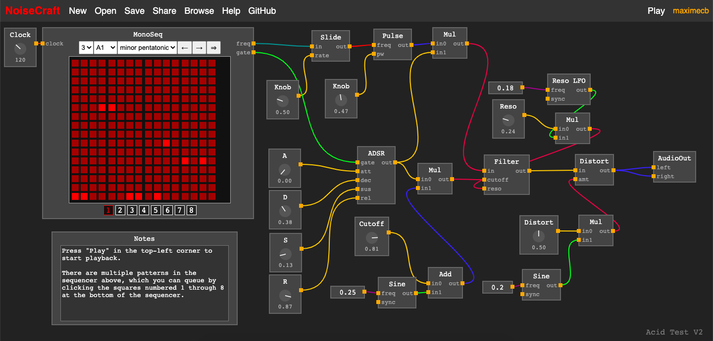

# NoiseCraft

**NoiseCraft is a work in progress, and we are looking for contributors to help build and debug it :)**

NoiseCraft is an open source, visual programming language and platform for
sound synthesis and music making, with the goal of creating a community for
the open exchange of musical ideas. The design is loosely inspired by
PureData, Max/MSP as well as other visual programming languages.
NoiseCraft is built on technologies such as the Web Audio and Web MIDI APIs, and
runs in a web browser. The plan is for the app to remain free to use and ad-free
for the foreseeable future.

<p align="center">
  
</p>

You can try NoiseCraft at [noisecraft.app](https://noisecraft.app), and browse projects shared by other
users at [noisecraft.app/browse](https://noisecraft.app/browse). Currently, this works in Chrome, Firefox and Edge but 
not reliably in Safari due to issues with their web audio implementation.
Please note that NoiseCraft is a passion project and a work in progress.
You may run into bugs, and support for mobile devices is currently lacking.

## Design

Design principles:
- NoiseCraft follows a minimalistic philosophy:
  - No web frameworks, just plain JS/HTML/CSS
  - Intentionally keep dependencies to a minimum
  - Prioritize features the users need
  - Avoid redundant features and feature creep
- In terms of user interface design:
  - Minimize the learning curve and reduce friction
  - Keep the user interface simple and uncluttered
  - Avoid drop-down menus and hidden options if possible
  - Use key combos and controls that will likely seem familiar to most users
  - Avoid ambiguity, use known/existing terminology wherever possible
- Visual programming language design:
  - There is only one data type: floating-point numbers
  - There is no distinction between control signals and audio signals
- Practical considerations:
  - Avoid images and sound samples to keep bandwidth/server costs low
  - Avoiding sound samples also forces people to think about how to generate sounds

NoiseCraft uses a multi-page design, as opposed to a single-page app. This means
the New, Help and Browse links open new tabs. This helps users avoid accidentally
losing their work when clicking other tabs, and makes it possible for us to send new users
direct links to the `/browse` and `/help` pages, for example.

The user interface uses an immediate-mode GUI. That is, the UI gets redrawn every time
an action is performed on the model. This makes it trivial to implement features such
as undo/redo, because we can simply store copies of previous project states. It also reduces
the coupling between the UI and the model. In practice, caching is used to avoid
redrawing the entire user interface for every single state change.

Audio is produced by the `AudioView` class (see `public/audioview.js`), which is
updated when state changes
occur in the model. This compiles the audio graph into JavaScript code that can then
be run in a background process (an `AudioWorklet`). We only use the web audio API
to output sound, not for sound synthesis. This helps us guarantee that the sound
produced for a given project will be the same on any browser or device.

Project files are saved in an easy to parse JSON format (.ncft), which could allow
external tools to eventually be built. For example, it's possible to imagine that
NoiseCraft projects could be compiled into VSTs.

## Contributing

We're more than happy to accept bug fixes. However, we want to avoid growing the
functionality of NoiseCraft too fast, and we strive to minimize dependencies and
overall complexity.
As such, we're going to be
be conservative about the additions to the project that we accept. If you would
like to contribute new features or major changes to the codebase, please open an
issue to discuss the proposed changes first, or comment on an existing issue.
Some of the contributions we're the most likely to accept are bugfixes. Helping
us track and eliminate bugs is a very useful contribution.

## Development Setup Instructions

We recommend developing using the Chrome web browser because it has the most mature
web audio implementation and has been the most extensively tested. 
We are waiting for a [Firefox bug](https://bugzilla.mozilla.org/show_bug.cgi?id=1572644) to be fixed,
and we've run into issues with the Safari web audio and pointer capture implementation.

Installing dependencies:

```
# Install nodejs and npm
# Use apt-get on Ubuntu/Debian or brew on macOS
sudo apt-get install -y nodejs npm

# Update npm
sudo npm install -g npm

# Install the dependencies for this project
npm install
```

To start the server locally:

```
node server.js
```

NoiseCraft is then accessible at `http://localhost:7773/`

To run tests locally:

```
node tests.js
```

## Running using Docker

To run the NoiseCraft server using Docker please follow these steps:
```
# Build docker NoiseCraft image
docker build . -t noisecraft

# Start docker NoiseCraft container
docker run -p 7773:7773 -d noisecraft
```

NoiseCraft is then accessible at `http://localhost:7773/`

## Server Configuration Parameters

The server can be configured using the following environment variables:

| Config Variable | Default Value | Description             |
|-----------------|---------------|-------------------------|
| DB_FILE_PATH    | ./database.db | SQLite file path        |
| HTTP_PORT_NO    | 7773          | HTTP server port number |
